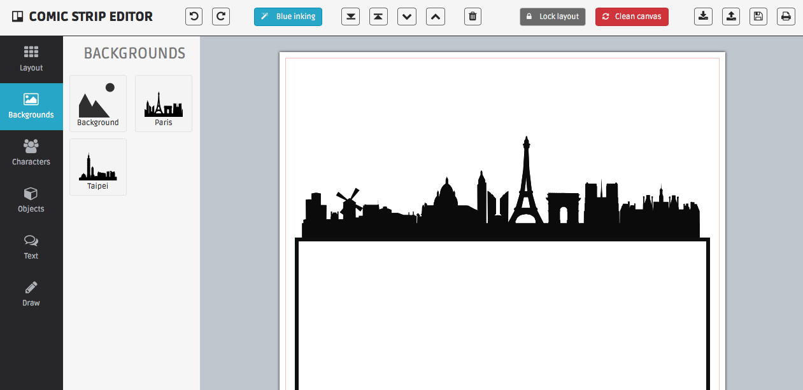

#Comicstrip Editor
Simple comic book sketching application built in JS. Built on **Fabric.js** library.

##Functionalities
######Drawing
1. Enter drawing mode
2. Free drawing **(black ink)**
3. Exit drawing mode

######Layout
4. Add single panel
5. Add premade layout

######SVG files
6. Add background **(3 presets)**
7. Add characters
8. Add objects 

######Editing Objects
9. Select objects
10. Select multiple objects
11. Resize objects
12. Rotate objects
13. Move objects
14. Bring front / back
15. Delete objects / panels

######Text
16. Add speech bubbles

######Miscellaneous
17. Clean canvas

##Todo features
- Undo
- Redo
- Add multiple pages
- **Drawing (?)**

######Layout
- Add more premade layout **(+)**
- Lock layout

######Objects
- Change color to blue ink
- Drag and drop to add
- Guidelines when moving **(+)**
- Make bigger handlers
- Prevent resizing and rotating of multiple objects

######Upload
- Implement upload feature